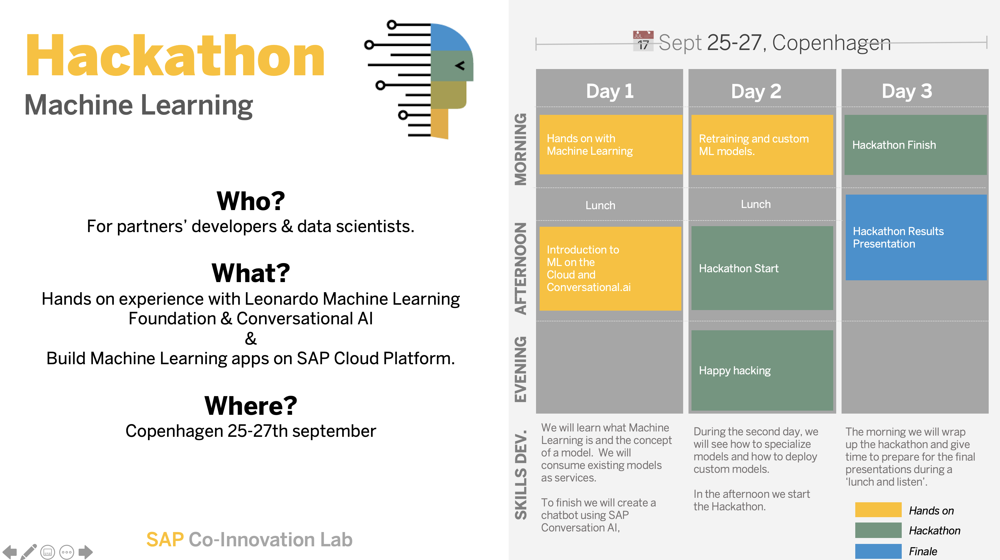

  

  <h3 align="center">SAP Nordic Machine Learning Hackathon 2019</h3>

  

    Please note that these are examples for the purposes of training only. This repository will not be supported or maintained. Under code samples there are some simple examples that will be used to show how you can use LML in your applications.
     
    <a href="https://github.com/joeybronner/ml-hackathon-copenhagen-2019/issues/new?template=bug.md">Report bug</a>
    ·
    <a href="https://github.com/joeybronner/ml-hackathon-copenhagen-2019/issues/new?template=feature.md&labels=feature">Request feature</a>
    ·
    <a href="https://coil.sap.com">COIL Website</a>
  

 

## Agenda

## Table of Contents

### 📅 Day 1
- [Session #1 - Machine Learning Services - Hands-on](/day1/mlservices-handson)
- [Session #2 - TYOM / BYOM](/day1/tyom-byom)
- [Session #3 - ConversationalAI - Hands-on](/day1/conversationalai-handson)

### 📅 Day 2
- [Session #1 - TYOM / BYOM - Hands-On](/day2/tyom-byom-hands-on)

### 📅 Day 3
- No content

## Contacts

- [Miliau PAPE](mailto:miliau.pape@sap.com)
- [Peter SNOWDON](mailto:peter.snowdon@sap.com)
- [Nathalie DIETZ](mailto:nathalie.dietz@sap.com)
- [Wael LABIDI](mailto:wael.labidi@sap.com)
- [Joey BRONNER](mailto:joey.bronner@sap.com)

## License

[MIT](https://tldrlegal.com/license/mit-license)