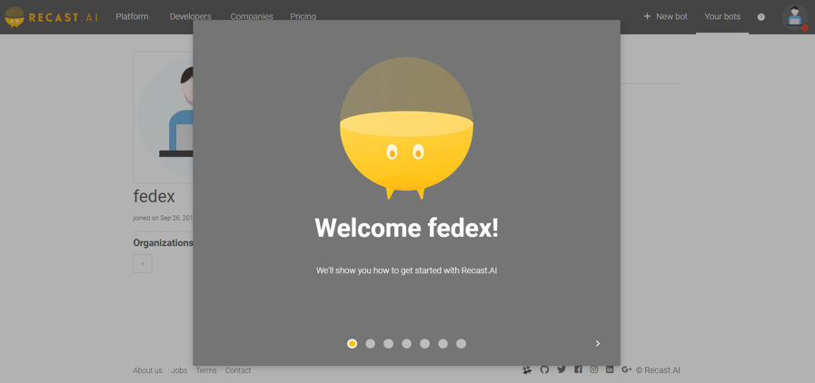
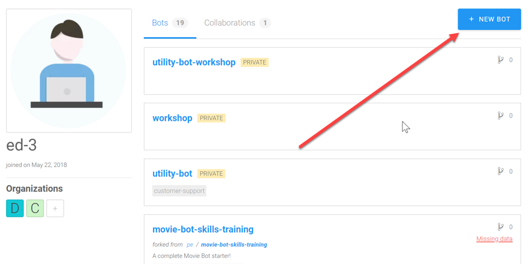
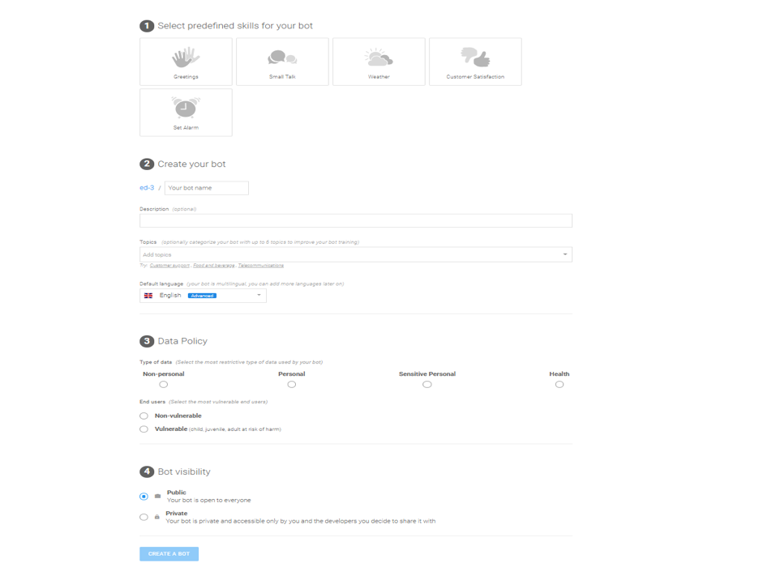

  
  <h1 align="center">SAP Conversational AI</h1>
  
Hands-On

 

## Table of Contents

### 👉Steps
- [Step #1 - Account creation](#step1)
- [Step #2 - Workshop exercice](#step2)

## Step 1 - Account creation

1.	Go to this website: https://cai.tools.sap  
2.	If you get the cookie sign, just click ok to close it.  
3.	Click on the yellow sign up button. You will get a sign-up form as follows:  

4.	Fill up the form as requested, check the boxes below and click sign up at the lower part of your screen:  

5.	You will receive a welcome message like the one below:  

6.	Once you click outside the grey welcome box, you will see your Dashboard:  

## Step 2 - Workshop exercice

1.	Copy [cps-image.jpg](/html-skeleton/cps-image.jpg) and [cps_mocked.html](/html-skeleton/cps_mocked.html) files.  
2.	Select +New BOT  

3.	We now see this screen:

4.	For this exercise, please select:  
* Greetings for predefined skills
* Name your bot: Utility Workshop Bot (for example)
* Topics: Customer support (for example)
* Data Policy: Non-personal
* End Users: Non-vulnerable 
* Bot visibility: Private

**Important to select Private or bot will be shared with community!**  

5.	Select CREATE A BOT. This will take a short time to create. We should now see the following:  

