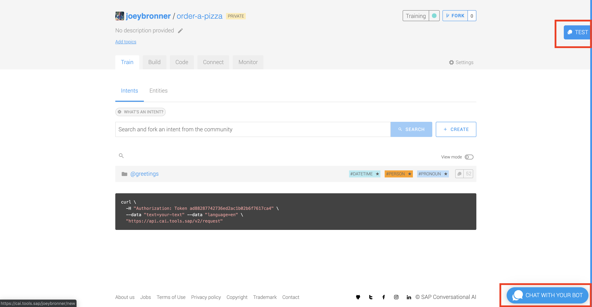
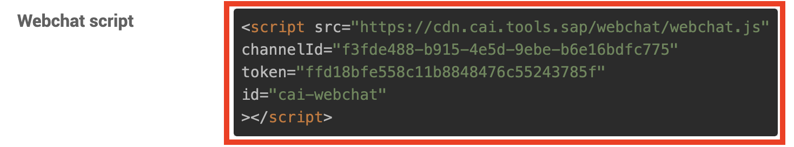

  
  <h1 align="center">SAP Conversational AI</h1>
  
Hands-On

 

## Table of Contents

### 👉 Steps

- [Step 1 - Account creation](#step-1---account-creation)
- [Step 2 - Workshop exercice](#step-2---workshop-exercice)
- [Step 3 - Forking an intent](#step-3---forking-an-intent)
- [Step 4 - Building Skills](#step-4---building-skills)
- [Step 5 - Configuring a skill](#step-5---configuring-a-skill)
- [Step 6 - Testing and improving](#step-6---testing-and-improving)
- [Step 7 - Setting up skills actions](#step-7---setting-up-skills-actions)
- [Step 8 - Deployment](#step-8---deployment)

# Step 1 - Account creation

1.	Go to this website: https://cai.tools.sap  
2.	If you get the cookie sign, just click ok to close it.  
3.	Click on the yellow sign up button. You will get a sign-up form as follows:  

4.	Fill up the form as requested
5.	You will receive a welcome message
6.	Once you click outside the grey welcome box, you will see your Dashboard:  

# Step 2 - Workshop exercice

1.	Copy [sappizza.png](html-skeleton/sappizza.png) and [sappizza.html](html-skeleton/sappizza.html) files.  
2.	Select **+ New BOT**  

3.	We now see this screen:  

4.	For this exercise, please select:  

 * Greetings for predefined skills  
 * Name your bot: Pizza Ordering Workshop Bot *(for example)*  
 * Topics: Customer support *(for example)*  
 * Data Policy: Non-personal  
 * End Users: Non-vulnerable  
 * Bot visibility: Private  

**Important to select Private or bot will be shared with community!**  

5.	Select **CREATE A BOT**. This will take a short time to create. We should now see the following:   

# Step 3 - Forking an intent

1.	Let’s add another intent so that the bot will be able to answer- who are you? It’s possible to search in the community for this intent!  
2.	Type in who are you shown below and click on **SEARCH**  
3.	I can know select an intent from the list.  

1. I've selected an intent that has an expression "*are you a bot*" listed.  
2. Click on **FORK.**  
3. I should now see three intents creates **@wru** , **@goodbye** , and **@greetings** shown below.  

7. Let's now look at **TEST** and **CHAT WITH YOUR BOT**. These can be found on the right-hand side of your screen shown here:  

1. Click on **TEST.**  
2. Type in **are you a bot?**  

 

10. We can see by typing in "**are you a bot?**" the platform does associate it to correct intent **- @wru.**  
11. Let's click on the **Test** tab to close out window and Select **CHAT WITH YOUR BOT.**  
12. Let's type in the same **"are you a bot?". We should see the following:**  

13. Why are we getting this message? This is because we have an intent not associated with a skill. The bot does not know how to act on this statement. Let's make a nicer, more user-friendly statement for the bot, and then get the bot to be able to answer "are you a bot" correctly.  

# Step 4 - Building Skills

1. Click on the **Build tab** shown here:  

1. Click on the **Fallback** skill.  
2. Select **Actions** and you should see the below.  

1. Click on the **pencil** to edit the message.  

5. I changed to the following:  

6. Typing in the **"are you a bot"** expression now has a friendlier fallback response, let's move onto getting the bot to respond in a meaningful way!  
7. Click on **the Build Tab** to go back to the builder 
8. You should see the following:  

# Step 5 - Configuring a skill

1. Click on the **greetings** skill.  
2. Click on the **Triggers**  
3. You should see the following:  

4. Click on the **+** shown here:  

5. You will see an If logic box **click** n the blank area, and a box will appear.  
6. Click on @wru and click **Save**  
7. You should now see the following:  

8. Click on the **Actions** Tab.  
9. We want to click on the bottom **ADD NEW MESSAGE GROUP.**  
10. Click on **ADD Condition.**  
11. We want to again add **@wru** in the **If logic box** and **SAVE.**  
12. Click on **SEND MESSAGE.**  
13. Click on **Text**  
14. I typed in the following:  

15. Make sure to click on SAVE to save the response.  
16. Clicking on the **+** above this response I can add additional responses that will be chosen at random if desired.  
17. I now have:  

# Step 6 - Testing and improving

1. Let's go back to **TEST YOUR BOT** and check our changes.  
2. Typing in "**are you a bot?**" again I have the desired results.  

3. We are now ready to start creating business related skills!  
4. Let's create an **Order a Pizza** intent    
5. Click on the **Train tab** on the top.  
6. Click on **+ Create** Intent shown below.  

7. Let's name this intent **order-a-pizza**.  
8. **Click** on **order-a-pizza** intent.  

9. Add several expressions related to ordering a pizza.  

10. Let's now create a **order-a-pizza**** Skill.**   
11. **Click** on **Build Tab.**  
12. Click on **+ Create Skill.**  
13. Name **order-a-pizza.**  
14. We will make this **Business Skill Type.**  
15. **Click** on **CREATE SKILL.**  
16. You can use the cross located in the top right of each skill to rearrange skills to your liking.

1.  **Click** on **order-a-pizza.**  
2.  **Click** on **Triggers tab.**  
3.  You will see an If logic box, **click** on the blank area, and a box will appear.  
4.  Click on @order-a-pizza-intent and click **Save.**  
5.  You should now see the following:  

# Step 7 - Setting up skills actions

1. **Click** on **Actions** tab.  
2. **Click** on **ADD NEW MESSAGE GROUP.**  
3. **Click** on **ADD CONDITION to trigger messages.**  
4. You will see an If logic box, **click** on the blank area, and a box will appear.  
5. **Click** on **@order-a-pizza-intent** and **click SAVE.**  
6. **Click** on **SEND MESSAGE.**  
7. **Click** on **Buttons.**  
8. **Click** on **Type your message box.**  
9. Add a message to invite the user to click to the pizza provider he would like to to his order.  
10. **Click** on **ADD A BUTTON.**  
11. **Click Link.**  
12. **Click** on **Button title.**  
13. For **Button Title-** let's label **Domino's** for example  
14. For **Web URL,** add the url of the website, copy: "https://www.dominos.mu/en/pages/order/#!/locations/search/?type=Delivery"  
15. **Paste** into **Web URL box.**  
16. **Click** on **ADD A BUTTON.**  
17. **Click Link.**  
18. For **Button Title-** let's label **Gorm's Magstraede**  
19. For **Web URL,** add the url of the website, copy: https://www.gormspizza.dk/restauranter/magstraede  
20. **Click SAVE.**  
21. **You should now see:**  

22. Let's test our changes- click on **CHAT WITH YOUR BOT.**  

23. **Clicking** on **Domino's** r **Gorm's Magstraede** should bring up the respective web pages.  

# Step 8 - Deployment

1.  Click on the **Connect**  

2. **Click** on **Webchat.**  
3. **The following box will display:**  

4. **Click on Color Scheme.**  
5. I want to match colors like SAP Website - Change **Accent Color** to Black and gold colors.  
6. Under **Header customization**, change **Header title** to SAP Pizza Ordering Bot.  
7. Under **Message Settings** add a **Welcome Message** - "Hello, welcome to the SAP Pizza Ordering website! Please let me know how I can assist you."  
8. Click on **CREATE**.  
9. Open the sappizza.html copied in [Step 1](#step-1---account-creation) with an HTML Editor.  
10. Copy the **channelID** found under **Webchat Script**.  

1.   Paste **channelID** into the sappizza.html file replacing **ENTER Channel ID Here&quot**.  
2.   Repeat same process for **token.**.  
3.   You should now have: *(Your channelID and token will be different, make sure to change or you will not be pointing to the bot you worked so hard at!)*  

  

1.  Make sure to **save**.  
2.  Open **sappizza.html** in your favorite browser.  
3.  We now have a working bot with a fake front end! Thanks for taking the time to go through this tutorial!  

