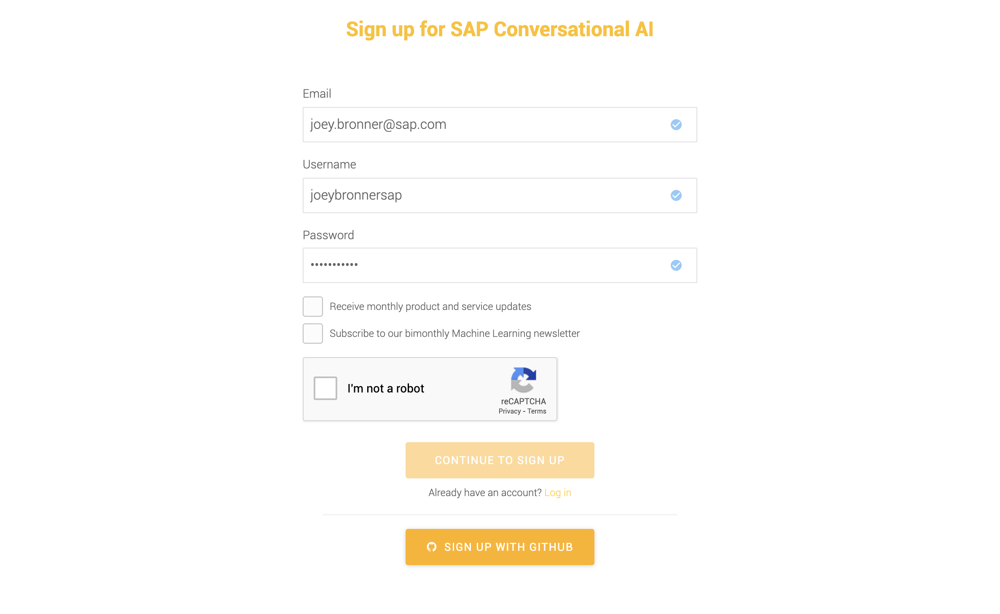

  
  <h1 align="center">SAP Conversational AI</h1>
  
Hands-On

 

## Table of Contents

### 👉 Steps

- [Step 1 - Account creation](#step-1---account-creation)
- [Step 2 - Workshop exercice](#step-2---workshop-exercice)
- [Step 3 - Forking an intent](#step-3---forking-an-intent)
- [Step 4 - Building Skills](#step-4---building-skills)
- [Step 5 - Configuring a skill](#step-5---configuring-a-skill)
- [Step 6 - Testing and improving](#step-6---testing-and-improving)
- [Step 7 - Setting up skills actions](#step-7---setting-up-skills-actions)
- [Step 8 - Deployment](#step-8---deployment)

# Step 1 - Account creation

1.	Go to this website: https://cai.tools.sap  
2.	If you get the cookie sign, just click ok to close it.  
3.	Click on the yellow sign up button. You will get a sign-up form as follows:  

4.	Fill up the form as requested
5.	You will receive a welcome message
6.	Once you click outside the grey welcome box, you will see your Dashboard:  

# Step 2 - Workshop exercice

1.	Copy [cps-image.jpg](/html-skeleton/cxc-image.jpg) and [cps_mocked.html](/html-skeleton/cxc_mocked.html) files.  
2.	Select **+ New BOT**  

3.	We now see this screen:  

4.	For this exercise, please select:  

 * Greetings for predefined skills  
 * Name your bot: Utility Workshop Bot *(for example)*  
 * Topics: Customer support *(for example)*  
 * Data Policy: Non-personal  
 * End Users: Non-vulnerable  
 * Bot visibility: Private  

**Important to select Private or bot will be shared with community!**  

5.	Select "CREATE A BOT". This will take a short time to create. We should now see the following:   

# Step 3 - Forking an intent

1.	Let’s add another intent so that the bot will be able to answer- who are you? It’s possible to search in the community for this intent!  
2.	Type in who are you shown below and click on SEARCH  
3.	I can know select an intent from the list.  

1. I&#39;ve selected an intent that has an expression &quot;are you a bot&quot; listed.  
2. Click on **FORK.**  
3. I should now see three intents creates **@wru** , **@goodbye** , and **@greetings** shown below.  

1. Let's now look at **TEST** and **CHAT WITH YOUR BOT**. These can be found on the right-hand side of your screen shown here:  

5. Click on **TEST.**  
6. Type in **are you a bot?**  

 

7. We can see by typing in &quot; **are you a bot?**&quot; the platform does associate it to correct intent **- @wru.**  
8. Let&#39;s click on the **Test** tab to close out window and Select **CHAT WITH YOUR BOT.**  
9. Let&#39;s type in the same **&quot;are you a bot?&quot;. We should see the following:**  

10. Why are we getting this message? This is because we have an intent not associated with a skill. The bot does not know how to act on this statement. Let&#39;s make a nicer, more user-friendly statement for the bot, and then get the bot to be able to answer &quot;are you a bot&quot; correctly.  

# Step 4 - Building Skills

1. Click on the **Build tab** shown here:  

2. Click on the **fallback** skill.  
3. Select **Actions** and you should see the below.  

4. Click on the **pencil** to edit the message.  

5. I changed to the following:  

6. Typing in the **&quot;**** are you a bot&quot;**expression now has a friendlier fallback response, let&#39;s move onto getting the bot to respond in a meaningful way!  

7. Click on **the Build Tab** to go back to the builder 
8. You should see the following:  

# Step 5 - Configuring a skill

1. Click on the **greetings** skill.  
2. Click on the **Triggers**  
3. You should see the following:  

4. Click on the &quot;+&quot; shown here:  

5. You will see an If logic box **click** n the blank area, and a box will appear.  
6. Click on @wru and click **Save**  
7. You should now see the following:  

8. Click on the **Actions** Tab.  
9. We want to click on the bottom **ADD NEW MESSAGE GROUP.**  
10. Click on **ADD Condition.**  
11. We want to again add **@wru** in the **If logic box** and **SAVE.**  
12. Click on **SEND MESSAGE.**  
13. Click on **Text**  
14. I typed in the following:  

15. Make sure to click on SAVE to save the response.  
16. Clicking on the &quot;+&quot; above this response I can add additional responses that will be chosen at random if desired.  
17. I now have:  

# Step 6 - Testing and improving

1. Let&#39;s go back to **TEST YOUR BOT** and check our changes.  
2. Typing in &quot;are you a bot?&quot; again I have the desired results.  

3. We are now ready to start creating business related skills!  
4. Let&#39;s create a **pay my bill intent.**  
5. Click on the **Train tab** on the top.  
6. Click on **+Create** Intent shown below.  

7. Let&#39;s name this intent **pay my bill intent.**  
8. **Click** on **pay my bill intent.**  

9. Add several expressions related to paying bill.  

10. Let&#39;s now create a **pay bill**** Skill.**   
11. **Click** on **Build Tab.**  
12. Click on **+ Create Skill.**  
13. Name **pay bill.**  
14. We will make this **Business Skill Type.**  
15. **Click** on **CREATE SKILL.**  
16.I know have the following: _(You can use the_ _located in the top right of each skill to rearrange skills to your liking.)_

17. **Click** on **pay-bill.**  
18. **Click** on **Triggers tab.**  
19. You will see an If logic box, **click** on the blank area, and a box will appear.  
20. Click on @pay-my-bill-intent and click **Save.**  
21. You should now see the following:  

# Step 7 - Setting up skills actions

1. **Click** on **Actions** tab.  
2. **Click** n **ADD NEW MESSAGE GROUP.**  
3. **Click** n **ADD CONDITION to trigger messages.**  
4. You will see an If logic box, **click** on the blank area, and a box will appear.  
5. **Click** n **@pay-my-bill-intent** and **click SAVE.**  
6. **Click** n **SEND MESSAGE.**  
7. **Click** n **Buttons.**  
8. **Click** n **Type your message box.**  
9. Copy text below under **Pay my bill** into **Type your message box.**  
10. **Click** on **ADD A BUTTON.**  
11. **Click Link.**  
12. **Click** n **Button title.**  
13. For **Button Title-** let&#39;s label **&quot;Login&quot;.**  
14. For **Web\_URL,** copy url for **login under**  **Pay my bill**  
15. **Paste** into **Web\_URL box.**  
16. **Click** n **ADD A BUTTON.**  
17. **Click Link.**  
18. For **Button Title-** let&#39;s label **&quot;Register Account&quot;.**  
19. For **Web\_URL,** copy url for **Register Account** under **Pay my bill**  
20. **Click SAVE.**  
21. **You should now see:**  

22. Let&#39;s test our changes- click on **CHAT WITH YOUR BOT.**  

23. **Clicking** n **Login** r **Register Account** should bring up the respective web page.  

# Step 8 - Deployment

1.  Click on the **Connect**  

2. **Click** on **Webchat.**  
3. **The following box will display:**  

4. **Click on Color Scheme.**  
5. I want to match colors like CPS site- Change **Accent Color** to Blue.  
6. Under **Header customization** , change **Header title** to CPS Chatbot.  
7. Under **Message Settings** add a **Welcome Message** - &quot;Hello, welcome to the CPS Energy website! Please let me know how I can assist you.&quot;  
8. Click on **CREATE**.  
9. Open the CPS\_Mocked.html copied in Step 1 with an HTML Editor. (Notepad works fine.)  
10. Copy the **channelID** found under **Webchat Script.**  

11. **Paste channelID** into the CPS\_Mocked.html file replacing **&quot;ENTER Channel ID Here&quot;.**  
12. Repeat same process for **token.**  
13. You should now have: **(Your channelID and token will be different, make sure to         change or you will not be pointing to the bot you worked so hard at!)**  

TODO: ajouter un screenshot du fichier HTML a jour !  

1. Make sure to **save**  
2. Close Notepad and click on **CPS\_Mocked.html.**  
3. We now have a working bot with a nice front end! Thanks for taking the time to go         through this document!  

TODO: ajouter un screenshot de l'image de fond   
